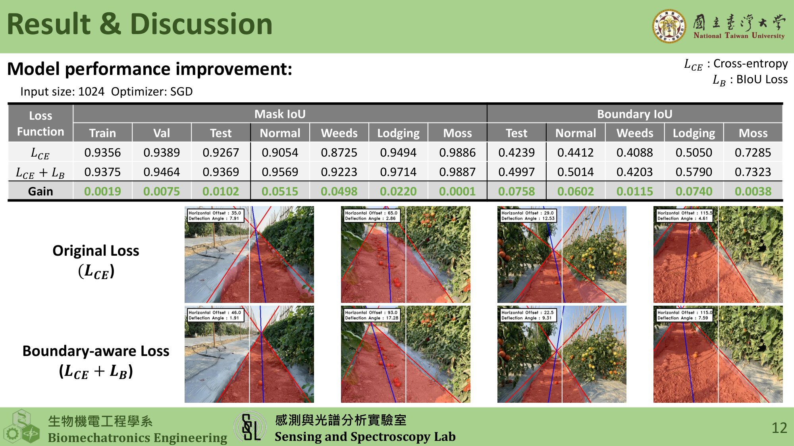

# Boundary-Aware Fast-SCNN

This repository provides an optimized PyTorch implementation of Fast-SCNN, tailored specifically for agricultural lane and plot segmentation. The core enhancement is the integration of the **Boundary Intersection over Union (BIoU)** loss mechanism, which significantly improves boundary prediction accuracy.

## 📌 Background and Motivation

In agricultural environments, traditional semantic segmentation models often struggle to capture precise boundaries between navigable lanes and crop plots. Small boundary deviations can lead to significant navigation errors for autonomous vehicles. 

### 🔬 Boundary-aware Loss Mechanism
To address the boundary challenge, we integrated the **Boundary-aware Loss (BIoU)** into the training phase. Unlike standard Cross-Entropy or OHEM losses that treat all pixels equally, our Boundary-aware Loss explicitly penalizes misclassifications near the semantic boundaries through the following mechanisms:

1. **Boundary Definition via Morphology**:
   We dynamically generate the ground truth boundary mask during training by applying morphological operations to the original segmentation mask. Specifically, the boundary is defined as the difference between the **Dilation** and **Erosion** of the mask. The kernel size for these operations scales dynamically with the input image size to maintain scale invariance.

2. **Loss Function Formulation**:
   The Boundary Intersection over Union (BIoU) is calculated specifically on these extracted boundary regions. The Boundary-aware Loss ($L_B$) is defined simply as $L_B = 1 - BIoU$.

3. **Dynamic Weight Linear Adjustment**:
   To ensure stable convergence, we use a dynamic loss weighting mechanism during training. In the early epochs, the model relies primarily on the standard Cross-Entropy Loss to learn global semantic features. As training progresses, the weight ($\lambda$) of the Boundary-aware Loss is linearly increased over time up to a predefined maximum ratio (e.g., 0.5). The final total loss is computed as: $L = (1 - \lambda) L_{CE} + \lambda L_B$.

**Optimization Impact**: By forcing the model to focus its learning capacity on difficult topological edges, this approach results in much cleaner predicted masks and drastically improves the geometric alignment of lane boundaries.



## 🏗️ Underlying Framework
This project is built upon the Fast-SCNN architecture.
- **Paper**: [Fast-SCNN: Fast Semantic Segmentation Network](https://arxiv.org/abs/1902.04502)
- **Original PyTorch Implementation**: [Fast-SCNN-pytorch](https://github.com/Tramac/Fast-SCNN-pytorch)

## 📁 Environment Setup

1. Clone the repository:
   ```bash
   git clone https://github.com/YourUsername/Boundary-Aware-Fast-SCNN.git
   cd Boundary-Aware-Fast-SCNN
   ```
2. Install requirements:
   ```bash
   pip install -r requirements.txt
   ```

## 🗃️ Dataset Preparation & Annotation Tool

### Dataset Structure
Your dataset should be organized following the standard Cityscapes format:
```text
datasets/
└── your_dataset_name/
    ├── image/
    │   ├── train/
    │   └── val/
    └── label/
        ├── train/
        └── val/
```

### LabelMe to LabelID Conversion
If you use [LabelMe](https://github.com/wkentaro/labelme) to annotate your images, the output will be in `.json` format. The training pipeline requires these annotations to be converted into single-channel PNG images where pixel values directly correspond to the class IDs.

We provide a unified tool, `json_to_labelIDs.py`, in the root directory to handle this conversion automatically:
```bash
# Basic usage (defaults to 'custom_agricultural' with 2 classes)
python json_to_labelIDs.py --input_dir "path/to/your/json/folder"

# Specify dataset type (e.g., 'asparagus' for 3 classes)
python json_to_labelIDs.py --input_dir "path/to/your/json/folder" --dataset_type asparagus
```
This script will parse all `.json` files in the target directory and generate the corresponding `_labelIds.png` training masks alongside them.

## 🚀 Quick Start (Demo)

This repository comes with a set of default demo files located in `datasets/` and `weights/`. You can immediately test the pipeline without any configuration.

### 1. Training Test
Run a quick test training loop on the demo dataset.
```bash
python train.py --epochs 1 --batch-size 1
```

### 2. Evaluation
Evaluate the model and automatically generate `pred_result/evaluation_metrics.csv` containing MIoU and BIoU metrics for each image.
```bash
python eval.py
```

### 3. Inference (Single Image)
Predict the mask for a single image and save the result to `pred_result/`.
```bash
python predict.py
```

## ⚙️ Configuration
The `config.yaml` file controls the entire training and dataset logic.
- `use_biou`: Set to `true` to enable Boundary-aware loss, `false` for standard loss.
- `dataset_type`: Supports `custom_agricultural` (2 classes), `asparagus` (3 classes), and `public_cityscapes` (19 classes).

## 📊 Evaluation Metrics
During `eval.py`, regardless of whether `use_biou` is turned on for training, the script will strictly calculate both **MIoU** and **BIoU** for every single sample. The granular results will be saved in a CSV format for detailed analysis.

